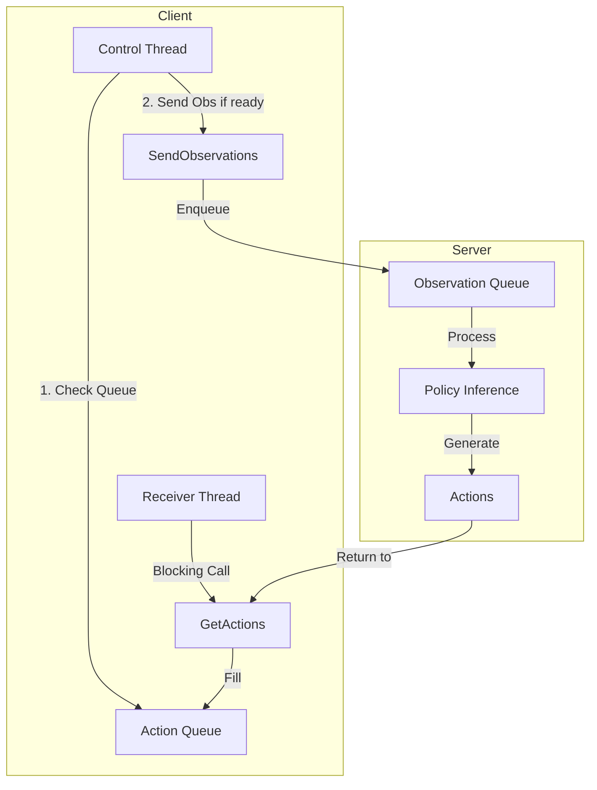

# Protocol Deadlock Analysis

## Current Protocol Design

The async inference protocol uses a **decoupled request-response pattern** with two separate gRPC calls:

1. **SendObservations** (Client → Server): Unary RPC that sends observations
2. **GetActions** (Client → Server): Unary RPC that blocks waiting for actions

### Thread Architecture



## The Fundamental Deadlock

### Initial State Problem
```
t=0: Client starts
     - action_queue = EMPTY
     - action_chunk_size = -1
     - latest_action = -1
     
t=1: Control Loop iteration 1
     - actions_available() = FALSE (queue empty)
     - _ready_to_send_observation() checks:
       * action_chunk_size = -1 (no chunks received yet)
       * With our fix: returns TRUE (because chunk_size <= 0)
       * Original code: -1/(-1) = 1 > 0.0 threshold → returns FALSE!
     - No observation sent → Server queue remains empty
     
t=2: Receiver Thread (parallel)
     - Calls GetActions(Empty)
     - Server checks observation_queue
     - Queue is EMPTY (no observations sent)
     - Blocks waiting for observation...
     
t=3: Control Loop iteration 2
     - Still no actions (receiver blocked)
     - Still may not send observation (depends on ready check)
     - DEADLOCK!
```

### The Core Issue

The protocol has **circular dependencies**:

1. **Client won't send observations** until action queue is low enough
2. **Server won't return actions** until it has observations to process
3. **Client can't get actions** without sending observations first
4. **Bootstrap problem**: Who goes first?

## Why Original E2E Test Passes

The original test passes because:
1. It uses `chunk_size_threshold = 0.0`
2. Initial state: `queue.size() / action_chunk_size = 0 / -1 = 0`
3. The comparison `0 <= 0.0` is TRUE by chance!
4. This accidentally allows the first observation to be sent

But this is **fragile** and breaks with any other threshold value.

## Protocol Design Flaws

### 1. Synchronous Blocking Calls
- `GetActions` is a **blocking unary RPC** that waits indefinitely
- No timeout or polling mechanism
- Thread blocks forever if no observations arrive

### 2. Incorrect Bootstrap Logic
```python
def _ready_to_send_observation(self):
    # Original problematic logic
    return self.action_queue.qsize() / self.action_chunk_size <= threshold
```
- Division by -1 on first iteration
- No special case for initial state

### 3. Missing Initial Handshake
- No explicit startup sequence
- No initial observation to prime the pump
- Relies on accidental conditions

### 4. Tight Coupling
- Observation sending depends on action queue state
- Action generation depends on observation availability
- No independent triggers

## Proof of Deadlock

### Formal Conditions for Deadlock (Coffman Conditions)

1. **Mutual Exclusion**: ✅
   - Server processes one observation at a time
   - GetActions returns one chunk at a time

2. **Hold and Wait**: ✅
   - Receiver thread holds connection while waiting for actions
   - Control thread holds robot while waiting for queue state

3. **No Preemption**: ✅
   - GetActions can't be interrupted
   - No timeout mechanism

4. **Circular Wait**: ✅
   ```
   Control Thread → waits for → Action Queue to be low
   Action Queue → waits for → Receiver Thread to fill it
   Receiver Thread → waits for → Server to return actions
   Server → waits for → Observations in queue
   Observations → wait for → Control Thread to send them
   ```

**All four conditions are met → DEADLOCK is guaranteed!**

## Solutions

### 1. Bootstrap Fix (Minimal)
```python
def _ready_to_send_observation(self):
    # Always send first observation to bootstrap
    if self.action_chunk_size <= 0:
        return True  # Bootstrap case
    # Normal operation
    return self.action_queue.qsize() / self.action_chunk_size <= threshold
```

### 2. Protocol Redesign (Proper)

#### Option A: Bidirectional Streaming
```proto
service AsyncInference {
    rpc StreamInference(stream Observation) returns (stream Action);
}
```
- Single connection for both directions
- No blocking calls
- Natural flow control

#### Option B: Async Pattern
```python
async def GetActions(self, request, context):
    # Non-blocking with timeout
    try:
        obs = await asyncio.wait_for(
            self.observation_queue.get(), 
            timeout=1.0
        )
        return process(obs)
    except asyncio.TimeoutError:
        return Empty()  # Allow retry
```

#### Option C: Push-Pull Pattern
```python
# Server pushes actions when ready
rpc SubscribeToActions(Empty) returns (stream Action);

# Client sends observations independently  
rpc PublishObservation(Observation) returns (Empty);
```

### 3. Add Explicit Bootstrap
```python
def start(self):
    # Send initial observation to prime the system
    bootstrap_obs = TimedObservation(
        timestamp=time.time(),
        observation=self.robot.get_observation(),
        timestep=0,
        must_go=True  # Force processing
    )
    self.send_observation(bootstrap_obs)
    # Then start normal threads...
```

## Recommendations

### Immediate Fix
1. Implement bootstrap observation sending
2. Fix the division-by-negative issue
3. Add timeout to GetActions

### Long-term Fix
1. **Redesign the protocol** to use bidirectional streaming
2. Remove circular dependencies
3. Add proper initialization sequence
4. Implement timeout and retry mechanisms

## Conclusion

The protocol has a **fundamental design flaw**: it creates a circular dependency that leads to guaranteed deadlock. The issue is not in the implementation but in the protocol design itself. The protocol needs either:

1. An explicit bootstrap mechanism, or
2. A complete redesign using bidirectional streaming

The current fixes only address symptoms, not the root cause. A proper solution requires breaking the circular dependency at the protocol level.
